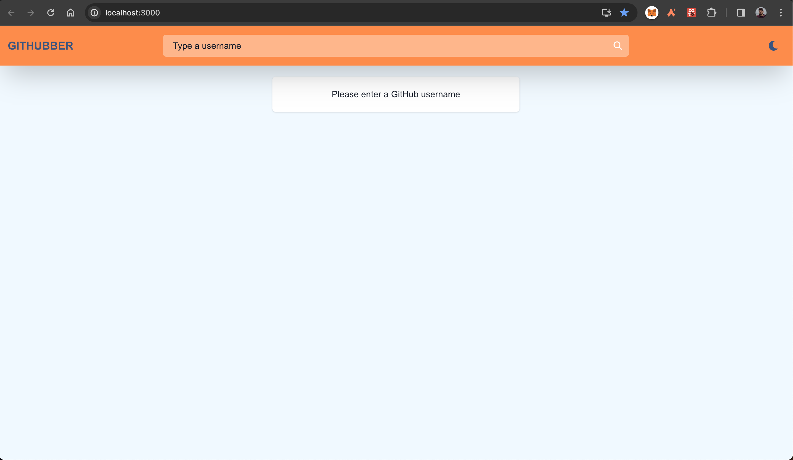
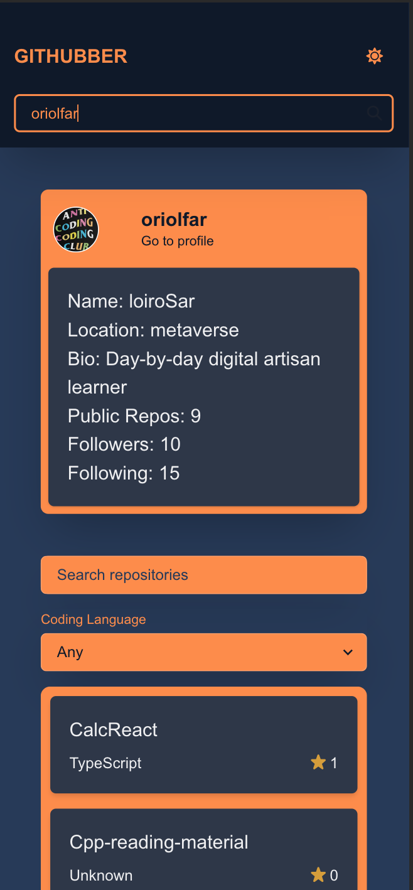
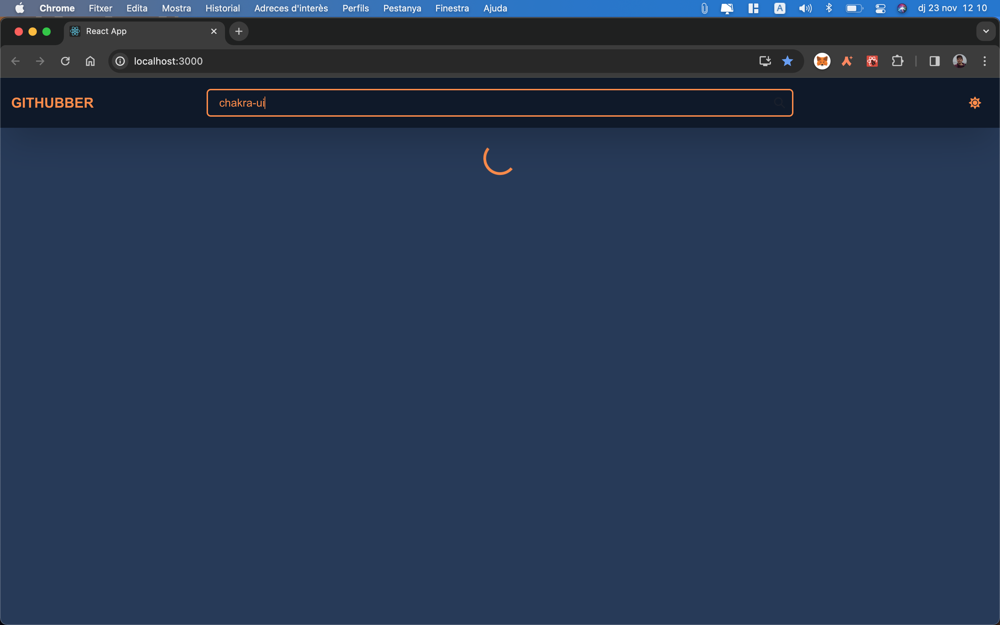
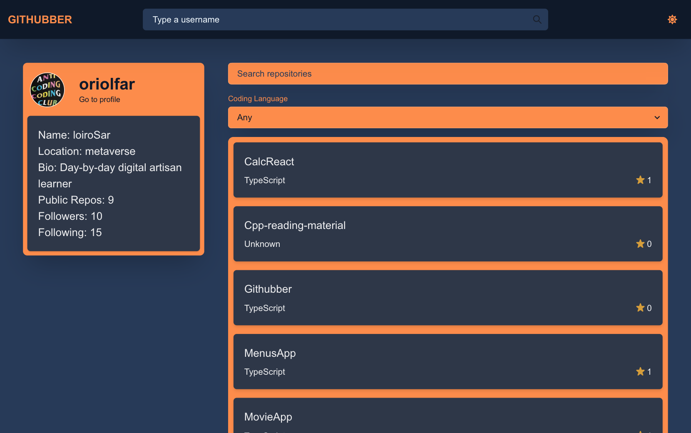
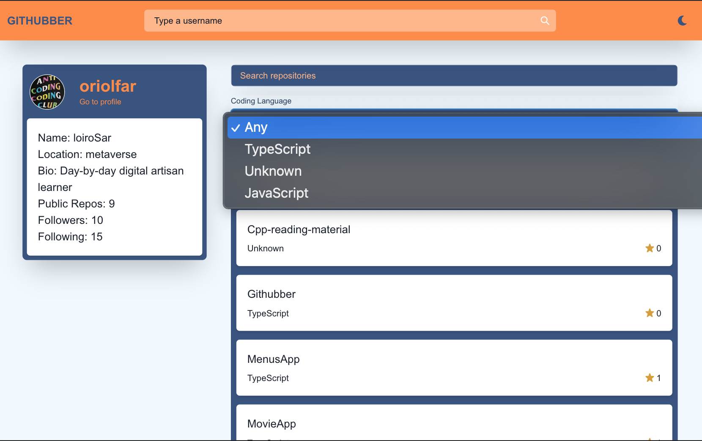
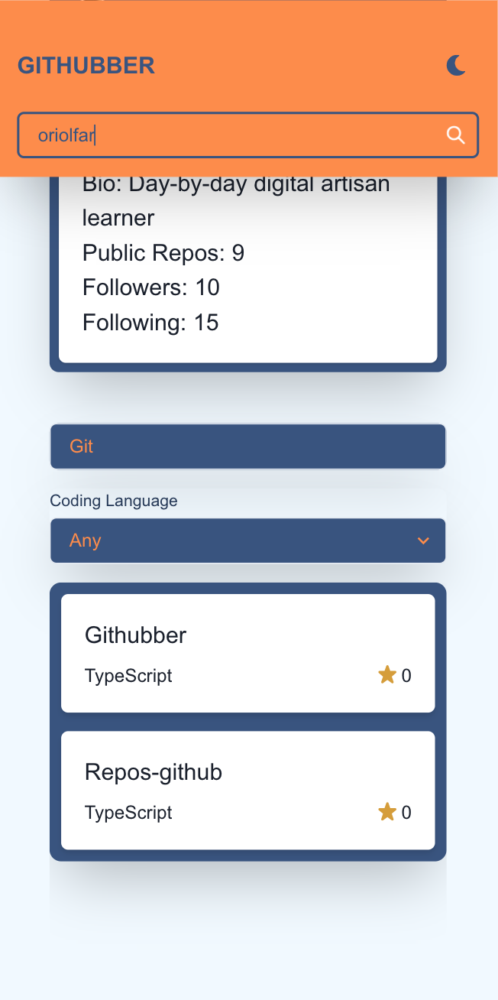

# GitHubber App (finding github user repos)

This application is designed to allow users to search for GitHub users and display their repositories. 
It's built using React, TypeScript, and Chakra UI components. Below is an outline of the project main features and structure.

## Features

  
 Extend the features

  - **Responsive Interface:** The application is responsive across various devices to provide a seamless user experience.
    
    

  - **User Search:** Allows users to input a GitHub username to display repositories associated with that user.
    
    

  - **Filtering Repositories:** Users can filter repositories by name and programming language.
    
    

  - **Light/Dark Mode:** Implemented a light/dark mode switcher for improved user experience based on their preference. As seen on the previous screenshots

## Project Structure

### `assets`
Contains any project-related assets like images or icons.

### `components`
- **`common`**: Holds reusable components used across different sections of the app, such as `ColorModeSwitcher`, `LoadingSpinner`, etc.
- **`layout`**: Contains layout-related components like `Navbar`, `Logo`, `SearchInput`, etc.
- **`repo`**: Components related to repository display and filtering such as `RepoCard`, `RepoList`, `LanguageSelect`, etc.
- **`user`**: Components dedicated to user information display like `UserAvatar`, `UserHeader`, `UserGrid`, etc.

### `hooks`
Contains custom hooks used throughout the application like `useFetchUser`, `useGithubUser`, `useRepositories`, etc.

### `pages`
- **`home`**: Holds components specifically related to the main home page, including `Home`, `LoadingUser`, `PromptUsername`, `UserContent`, `UserNotFound`, etc.

### `routes`
Contains the main routing structure for the app defined in `AppRouter`.

### `services`
Holds service-related files, such as `githubServices.ts`, which interacts with the GitHub API.

### `tests`
Includes various test files to ensure the functionality of components and services, such as `App.test.tsx`, `Home.test.tsx`, `githubServices.test.ts`, etc.

### Other Files
- `App.tsx`: Main component rendering the application.
- `index.tsx`: Entry point of the application.
- `react-app-env.d.ts`, `reportWebVitals.ts`, `serviceWorker.ts`, `setupTests.ts`: Configuration and setup files for the React app.
- `theme`: Contains the Chakra UI theme configuration file.

## Getting Started

1. Clone the repository.
2. Run `npm install` to install project dependencies.
3. Start the application using `npm start`.
4. Access the application in a web browser.

## Tests

The application includes various tests to ensure code functionality and robustness. Run tests using `npm test` or `npm test -- --watchAll=false`.
